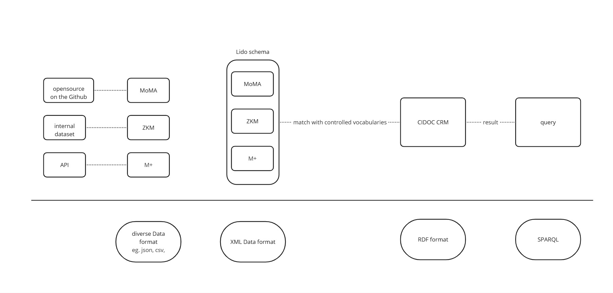

# Master Project
This is a part of my master thesis in D.H. 
Standardized metadata and terminology frameworks in the field of art often struggle to capture the complex contextual dimensions around artworks and artists. While these standards are essential for ensuring consistency and interoperability between data, they limit expressive depth and diversity. To address this, the semantic principle, which links heterogeneous data and enables knowledge extension, offers a potential solution to these challenges. This study examines how semantic based models such as CIDOC CRM and LIDO Schema can enrich contextual representation within existing frameworks. Through a case study of *A Tribute to John Cage* by Nam June Paik, the study describes the development of mapping rules and a corresponding dataset, showing how these semantic frameworks can enhance contextual representation and identifying practical challenges that come up in the process.
The mapping code for the MoMA individual dataset to LIDO Schema and the mapping rule for LIDO to CIDOC CRM transformation using XSLT are published as part of this study.
The overall workflow follows this process:

